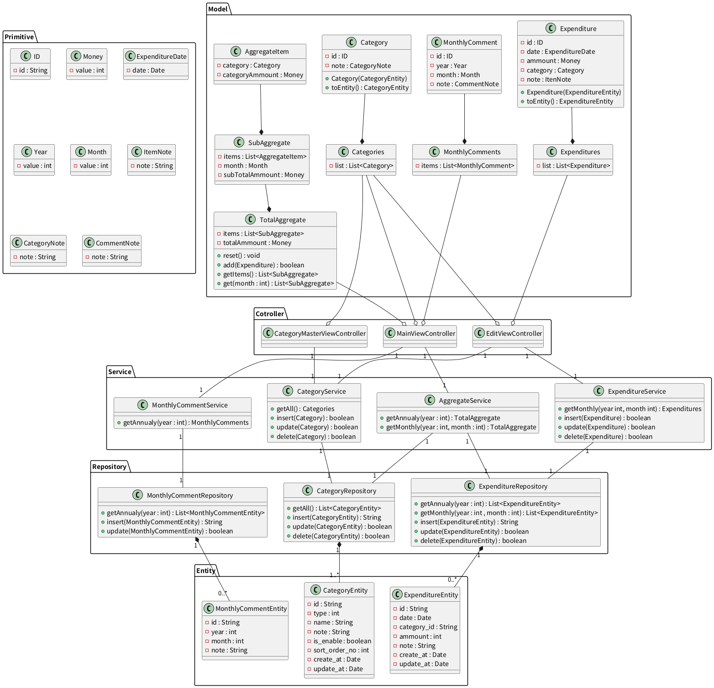

# クラス図

## 注意

* システム構造の設計や把握が目的で全ての操作やメンバを表現・網羅している訳ではないので注意

## Controller

* 画面に情報を渡す

## Model

* 画面に反映させる際のデータ
* Entity の事は知っている(変換可能)

## Service

* 画面からの操作をリポジトリに伝える

## Primitive

* モデル内では int や String はそのまま使わないこととする
  * 独自クラスでラップする

## Repository

* データベースの操作クラス
* こちら側からはシステムの実装のことを知らない
  * Entity の事は知っている

## Entity

* データベースのテーブルの構造に合わせる
* インスタンス１個がデータベースの１行辺りに該当
* こちら側からはシステムの実装のことを知らない

